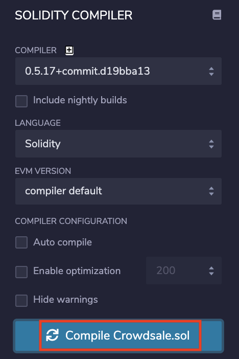
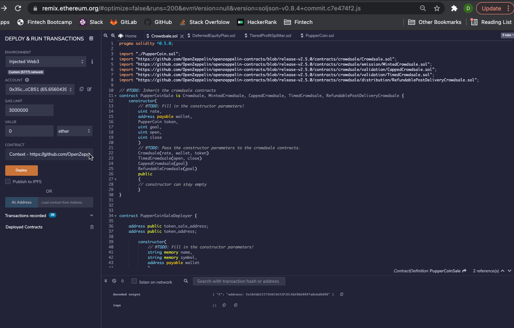
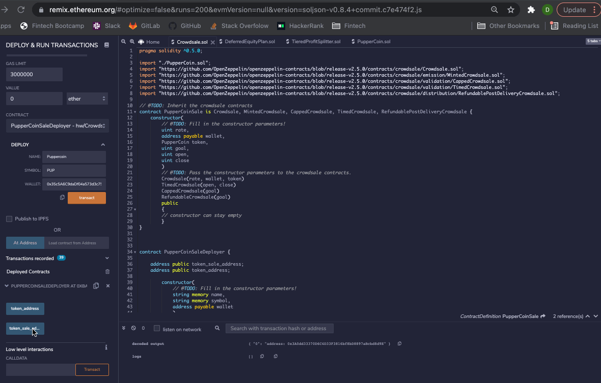
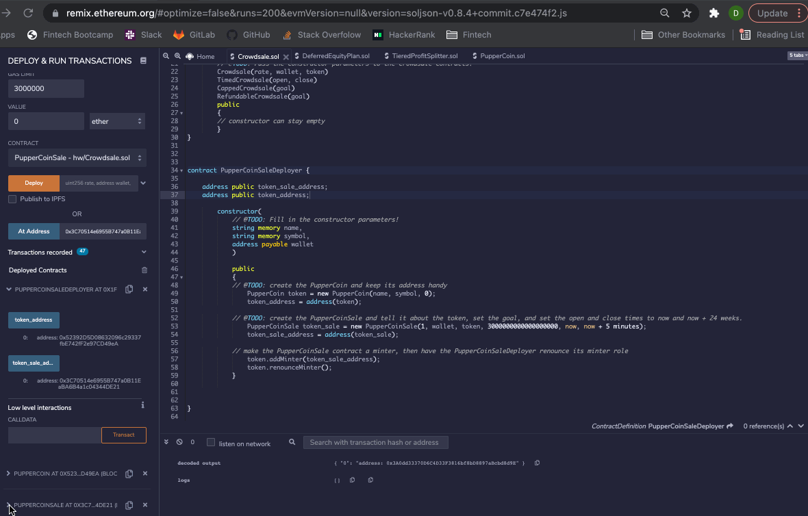
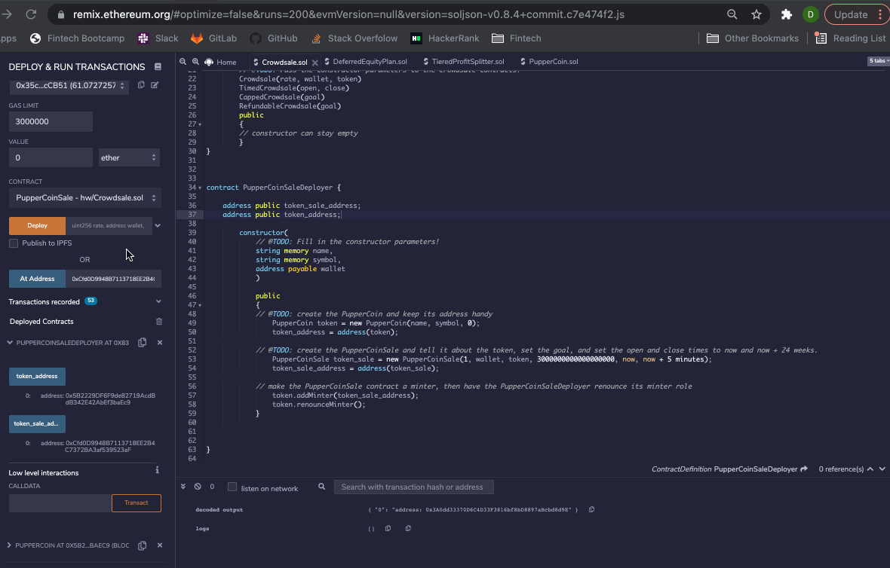
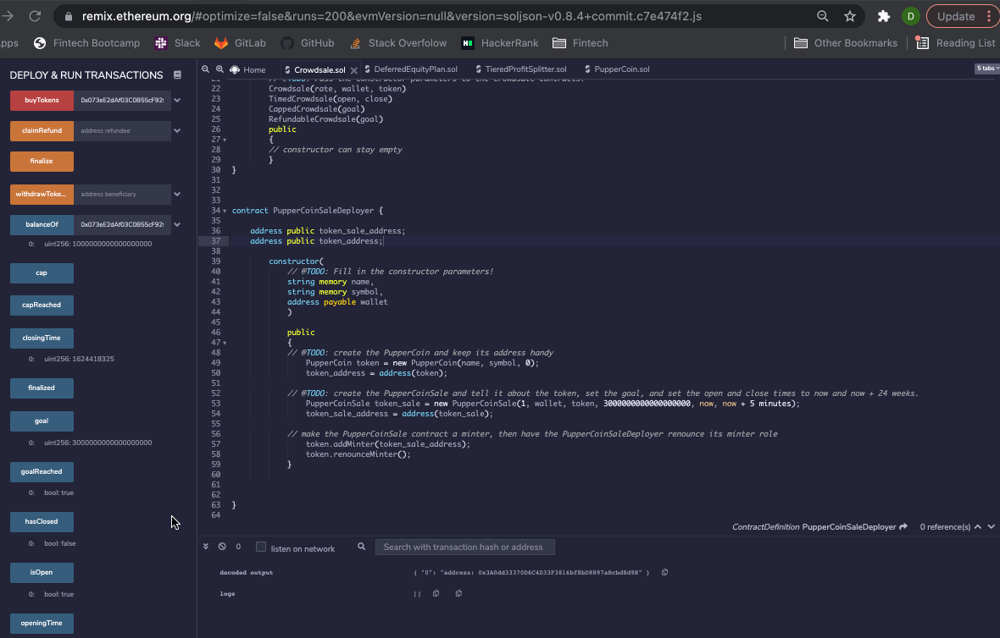

# Puppercoin Crowdsale

The following code creates an ERC20 token that will be minted through a Crowdsale contract which is leveraged from the OpenZeppelin Solidity library.  This crowdsale contract will manage the entire process, allowing users to send ETH and get back PUP (PupperCoin).  This contract will mint the tokens automatically and distribute them to buyers in one transaction.  The Crowdsale is required to enable refunds if successful and the goal is met, which is a maximum of 300 Ether.  The crowdsale will run for 24 weeks.  The Crowdsale will function over three smart contracts: PupperCoinSaleDeployer, PupperCoinSale and PupperCoin. These contracts have been deployed over the Kovan Test Networks with following addresses:

- **PupperCoinSaleDeployer Address: 0xc0312ad03f46D92e706Bf853CF9691f32e7e83B0**
- **PupperCoin Address: 0x1839c47F092b41276AfeE8db9F69B2eeEF857775**
- **PupperCoinSale Address: 0xbE3Eb231dEb7c9F93Bf5B0F8a00dA5cE01334428**

---

## Technologies

Language: Solidity

Developed with [Remix](https://remix.ethereum.org/) and [MetaMask](https://metamask.io/)

---

## Instructions
*For the purpose of this demonstration, the goal has been set to 3 Ether, the length of the Crowdsale has been shortened and all transactions are performed on a test network*

1. Compile PupperCoinSaleDeployer, PupperCoinSale and PupperCoin contracts

2. Deploy PupperCoinSaleDeployer contract

3. Deploy PupperCoin and PupperCoinSale contracts

4. Buy PupperCoin tokens and check out Crowdsale functionality

5. Reach PupperCoin Crowdsale goal

6. Close and finalize Puppercoin Crowdsale

---

## Contributors

Drew Disbrow Marnell: dldmarnell@gmail.com

---

## License

MIT License
Copyright (c) 2021 Drew Disbrow Marnell

